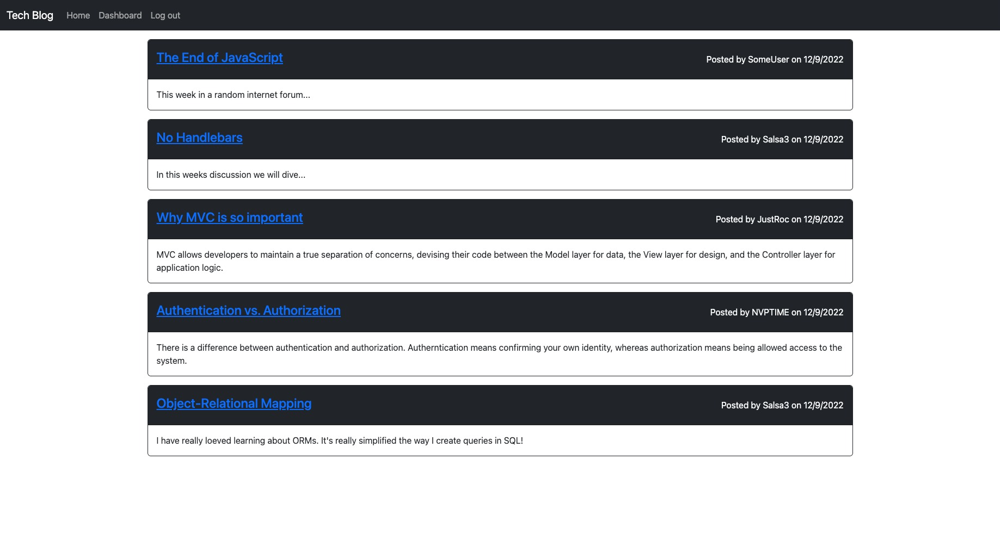

# Tech Blog

## Description

The purpose of this project was to practice using the Model-View-Controller paradigm in its architectural structure. Building the project also allowed me to work with Handlebars.js as the templating language. After completing this project I can actually wrap my head around how some other similar sites might be built. This site can be used  to publish articles, blog posts, thoughts and opinions on tech.

## Table of Contents

- [Installation](#installation)
- [Usage](#usage)
- [Credits](#credits)
- [License](#license)

## Installation

The user can clone the code from the GitHub repo. Once the code is cloned and opened in a code editor the user should install all npm packages by running 
```
npm i
```
The user will also have to create a .env file in order to store their credentials for the connection. The user will have to input  DB_NAME, DB_USER, DB_PW, and SESSION_SECRET variables with their credentials as the values. The next step is to run the schema file with mysql. The user will enter their mysql shell and run
```
SOURCE db/schema.sql 
```
from the root of the project. The user can now exit the mysql shell. The user can seed the database running
```
npm run seed
```
To invoke the application the user can run 

```
npm start
```
If the user wants to run in a dev environment so the server refreshes after changes are made the user should run
```
npm run watch
```

## Usage

Once the user enters the site they can navigate the site using the navbar at the top. Before they can interact with most of the site they will need to either log in or sign up. This can be done by clicking on the log in button. Once on this screen the user can enter their username and password to login or create a new account.

Once logged in the user can view their dashboard where they will find any previous posts they have written. They can click on one of these to edit or delete it. They can also navigate back to the homescreen to view posts written by other bloggers.

If the user clicks on another user's post they will have the option to leave a comment.

After reading their fair share of blogs for the day the user can log out until they are ready for more.





[Tech Blog](https://lit-savannah-08132.herokuapp.com/ "Deployed Tech Blog Site")

## Credits

[README Template](https://coding-boot-camp.github.io/full-stack/github/professional-readme-guide 'Professional README Guide')

[Dataset JavaScript](https://www.educba.com/dataset-javascript/ "Dataset JavaScript Tutorial")

## License

N/A